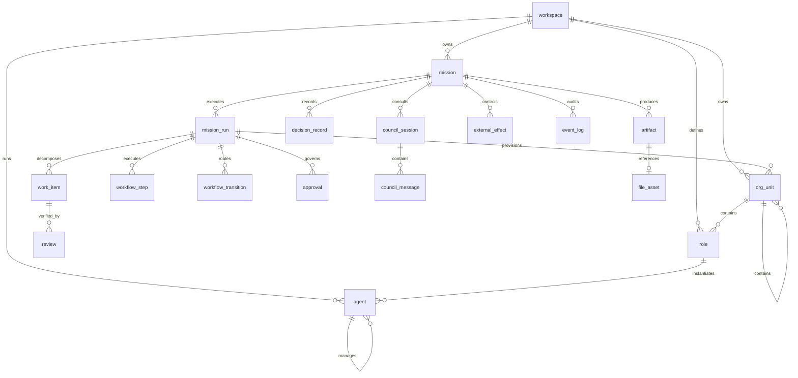

# DB 리빌드 설계서 — v0.9.0

## 1. 결론

v0.9.0은 **단일 SQLite DB, 18개 물리 테이블**을 사용한다.

```text
v0.8.0  44 Prisma models
v0.9.0  18 canonical physical tables
```

폐기한 대안:

```text
44-table Runtime Ledger
        +
18-table Core Projection DB
```

이중 DB는 물리 구조와 장애 지점을 늘리고 Local-First 단일 사용자 목적에 맞지 않으므로 채택하지 않았다.

## 2. ER 구조



## 3. 테이블 정의

### Organization Core

| 테이블 | 핵심 필드 | 설명 |
|---|---|---|
| `workspace` | slug, schema_version, owner_principal_id | 단일 로컬 업무 공간 |
| `org_unit` | parent_id, unit_type, mission_run_id | 회사·부서·팀 계층 |
| `role` | capabilities_json, permissions_json, is_verifier | 역할 정의 |
| `agent` | role_id, manager_agent_id, budget_micros | 실행 Agent 인스턴스 |

### Mission Core

| 테이블 | 핵심 필드 | 설명 |
|---|---|---|
| `mission` | objective, mission_type, risk_level, budget_micros | 업무 목표 |
| `mission_run` | idempotency_key, state_json, lease_epoch | 실행 단위 |
| `work_item` | org_unit_id, agent_id, criteria_json | 실제 배정 작업 |

### Workflow Runtime

| 테이블 | 핵심 필드 | 설명 |
|---|---|---|
| `workflow_step` | key, step_type, status, input/output | 실제 실행 단계 |
| `workflow_transition` | from/to, condition, sequence | 실제 선택된 경로 |

### Quality & Governance

| 테이블 | 핵심 필드 | 설명 |
|---|---|---|
| `review` | review_type, verdict, evidence, failure | 독립 검증·Failure 통합 |
| `approval` | approval_type, scope_hash, decision | 모든 승인 통합 |

### AI Council & Decision

| 테이블 | 핵심 필드 | 설명 |
|---|---|---|
| `council_session` | topic, current_round, budget | Council 세션 |
| `council_message` | role/agent, message_type, token/cost | 분석·비판·종합 메시지 |
| `decision_record` | source_type, summary, confidence | 최종 결정 기록 |

### Delivery & Operations

| 테이블 | 핵심 필드 | 설명 |
|---|---|---|
| `artifact` | artifact_type, content, evidence, version | 검증된 산출물 |
| `external_effect` | action_type, scope_hash, idempotency_key | 통제된 외부 행동 원장 |
| `event_log` | source, sequence, event_type, data | 단일 감사 타임라인 |
| `file_asset` | path, checksum, content_type | 로컬 파일 metadata |

## 4. 제거된 중복

| v0.8.0 개념 | v0.9.0 |
|---|---|
| Organization + Team + MissionDepartment + MissionTeam | `org_unit` |
| AgentRole + RoleDefinition | `role` |
| AgentInstance | `agent` |
| Dispatch + GraphNodeRun + GraphRoleInvocation | `workflow_step` |
| GraphEvent route + edge data | `workflow_transition` |
| Evaluation + FailurePacket + ShadowAssessment | `review` |
| DecisionRecord + StaffingRequest + TeamFormationRequest approvals | `approval` + `decision_record` |
| AuditEvent + MissionEvent + GraphEvent + OrganizationRuntimeEvent | `event_log` |
| Artifact + Deliverable + OrganizationPlan artifact | `artifact` |

## 5. Checkpoint 단순화

별도 `GraphCheckpoint` 테이블은 제거한다. 로컬 Inline Runtime에서는 다음 조합으로 재개 상태를 복원한다.

```text
mission_run.state_json
workflow_step.status/output_json
workflow_transition.sequence
external_effect.status
approval.status
review.verdict
ordered event_log
```

## 6. 비용과 숫자

비용은 Float USD 대신 integer micros로 저장한다.

```text
USD 1.25 → 1,250,000 micros
```

이는 누적 오차와 DB별 Float 표현 차이를 줄인다.

## 7. 인덱스

주요 인덱스:

```text
mission(workspace_id, status, updated_at)
mission_run(mission_id, status, created_at)
org_unit(mission_run_id, parent_id, unit_type)
work_item(mission_run_id, status, sequence)
workflow_step(mission_run_id, status, created_at)
review(mission_run_id, status, review_type)
approval(mission_run_id, status, approval_type)
event_log(mission_run_id, sequence, created_at)
external_effect(mission_run_id, status, action_type)
```

## 8. 미래 PostgreSQL 전환

`prisma/schema.supabase.prisma`는 18개 모델과 같은 도메인 구조를 유지한다. 현재 Runtime은 이를 사용하지 않는다. 멀티사용자 전환 시 사용자·Tenant·Membership·Credential·Queue를 새 버전에서 명시적으로 추가한다.
