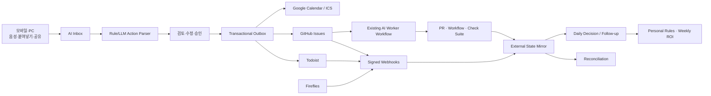

# JM-AI Action Hub

> 자연어·음성·복사/붙여넣기로 수집한 요청을 일정·개인 업무·개발 작업으로 구조화하고, 사람·AI·외부 응답의 상태를 **실제 완료까지** 추적하는 승인 기반 Action Control System.

## 릴리스 상태

| 항목 | 현재 상태 |
|---|---|
| 버전 | `0.8.0` Mobile Foundation 릴리스 |
| 기본 시간대 | `Asia/Seoul` |
| 입력 | 네이티브 iOS Companion, Share Extension, PWA, 클립보드, 음성, REST/MCP |
| 실행 원장 | Todoist, GitHub Issues, Google Calendar 또는 로컬 ICS |
| 상태 회수 | Todoist/GitHub Webhook, Provider Reconciliation |
| AI 실행 | 기존 Codex·Claude·Copilot·Orca·Hermes·Master Worker GitHub Workflow 호출 |
| 후속 관리 | Waiting-for, follow-up 만료, 응답 도착·후속 연락 상태 |
| 계획 지원 | 가용시간·버퍼·과부하·Top 업무·AI 위임 후보 계산 |
| 회의 | Fireflies Webhook/GraphQL Action Item 수집 후 승인 계획 생성 |
| 개인화 | 안전 필드만 적용하는 승인형 개인 규칙 제안 |
| 데이터베이스 | SQLite 개인 모드, PostgreSQL 운영 모드, Alembic 마이그레이션 |
| 실행 신뢰성 | Transactional Outbox, 재시도, 중복 방지, stale-lock 복구, 감사 로그 |
| 네이티브 모바일 | QR 페어링, 기기별 Scope, 회전형 Refresh Token, 오프라인 Capture, Delta Sync, APNs Queue |
| 기본 실행 모드 | `dry_run` — 외부 시스템을 변경하지 않음 |
| 자동 검증 | warnings-as-errors, statement coverage 80% 이상, OpenAPI·HTTP·마이그레이션 검증 |

## 제품 경계

Action Hub는 새 Todo·Calendar·Kanban·회의 녹음·코딩 에이전트를 만들지 않습니다.

| 책임 | 기존 제품 재사용 | Action Hub가 추가하는 가치 |
|---|---|---|
| 개인 업무 | Todoist | 자연어 분류, 승인, 외부 완료 상태 회수 |
| 일정 | Google Calendar 또는 ICS | 일정 후보 생성, 중복 안전 등록, 상태 대조 |
| 개발 업무 | GitHub Issues/PR/Actions | Issue→Worker→PR→Check→Merge 연결 |
| AI 코딩 | Codex·Claude Code·Copilot·Orca·Hermes | 기존 Workflow 선택·호출·상태 추적 |
| 회의 전사 | Fireflies | Action Item을 프로젝트 맥락으로 재분류·승인 |
| 일일 계획 | 기존 Calendar/Planner | 가용량과 위험을 계산하는 얇은 Decision Layer |

고정 원칙은 다음과 같습니다.

```text
원문 수집 → 구조화 → 사람 승인 → 외부 등록
          → 외부 상태 회수 → 사람/AI 실행 → 증거 확인 → 완료
```

## 전체 구조



## 단계별 구현 범위

| 단계 | 버전 기준 | 구현 결과 |
|---|---|---|
| 1. 운영 기반 | `0.1.1` | Alembic, Outbox, Retry, DB/Connector 진단, 별도 Worker |
| 2. 폐쇄형 동기화 | `0.2.0` | Todoist/GitHub Webhook, 서명, Delivery 중복 차단, Reconciliation, Conflict |
| 3. Human–AI Router | `0.3.0` | AI/Hybrid 실행자, Worker Adapter, GitHub Workflow dispatch, PR/CI/Merge 회수 |
| 4. Commitment | `0.4.0` | Waiting-for, Follow-up 시각, 응답 도착, 후속 연락, 만료 처리 |
| 5. Planning | `0.5.0` | 예상시간, Deadline, Work mode, 가용시간, 버퍼, 과부하, Top 업무 |
| 6. Meeting Intake | `0.6.0` | Fireflies V2 Webhook, GraphQL Action Item, 재처리, 승인 계획 |
| 7. Learning & ROI | `0.7.0` | 개인 규칙 제안·승인, 주간 지표, 추정 절감시간, 운영 PWA 확장 |
| 8. Mobile Foundation | `0.8.0` | QR 페어링, 기기별 Scope, 회전형 Refresh Token, 오프라인 Capture, revision 충돌, 변경분 동기화, APNs Outbox |

## 네이티브 iOS Companion

`JM-AI Action Hub iOS v0.1.0`은 이 서버의 업무 로직을 복제하지 않고, iPhone에서 수집·검토·승인·활동 확인을 수행하는 전용 Companion입니다.

```text
iPhone Share Extension / 음성 / 붙여넣기 / App Intent
                    │
                    ▼
             오프라인 App Group Queue
                    │ HTTPS + Bearer
                    ▼
Action Hub Server v0.8.0 Mobile Gateway
  ├─ 1회용 QR Pairing
  ├─ 15분 Access Token
  ├─ 회전형 Refresh Token + 재사용 탐지
  ├─ Capture Idempotency
  ├─ Revision Conflict
  ├─ Delta Sync Cursor
  └─ APNs Push Outbox
                    │
                    ▼
        기존 v0.7 Closed-loop Runtime
```

관리자 `X-Action-Hub-Key`와 Todoist·GitHub·Google 자격증명은 iPhone에 저장하지 않습니다. 서버 관리자가 5분 유효 Pairing QR을 발급하고, 앱은 제한 Scope의 기기별 토큰만 Keychain에 보관합니다.

### 페어링 QR 생성

```bash
action-hub mobile-pairing \
  --base-url https://action-hub.example.com \
  --qr-output ./pairing.svg \
  --print-qr
```

### 기기 조회·해제

```bash
action-hub mobile-devices
action-hub mobile-revoke <device-id>
```

### 모바일 운영 환경변수

```dotenv
ACTION_HUB_MOBILE_ENABLED=true
ACTION_HUB_MOBILE_PUBLIC_BASE_URL=https://action-hub.example.com
ACTION_HUB_MOBILE_ACCESS_TOKEN_SECRET=<32자 이상 별도 비밀키>
ACTION_HUB_MOBILE_ACCESS_TOKEN_MINUTES=15
ACTION_HUB_MOBILE_REFRESH_TOKEN_DAYS=30
ACTION_HUB_MOBILE_REFRESH_REUSE_GRACE_SECONDS=30
ACTION_HUB_MOBILE_PAIRING_TTL_SECONDS=300
```

APNs Live 전송은 Apple Developer Portal에서 발급한 `.p8` Provider Key가 필요합니다. 설정하지 않아도 앱은 Foreground/Background Refresh와 수동 동기화로 동작합니다. 상세 절차는 `docs/25_IOS_PAIRING_APNS_OPERATIONS_KR.md`를 참조합니다.

## 빠른 실행

### 1. Python 로컬 설치

```bash
unzip jm-ai-action-hub-server-v0.8.0.zip
cd jm-ai-action-hub-server
./scripts/bootstrap.sh
./scripts/run.sh
```

별도 터미널에서 내구성 Worker를 실행합니다.

```bash
./scripts/run-worker.sh
```

브라우저에서 `http://localhost:8787`을 열고 다음 명령으로 API 키를 확인해 PWA 설정에 저장합니다.

```bash
grep '^ACTION_HUB_API_KEY=' .env
```

초기 설정은 `dry_run`입니다. 외부 토큰 없이 입력→분석→승인→Outbox→상태 표시까지 확인할 수 있습니다.

### 2. Docker Compose

```bash
cp .env.example .env
python3 scripts/generate_api_key.py
# 생성한 키를 .env의 ACTION_HUB_API_KEY에 입력
docker compose up -d --build
```

PostgreSQL 운영 구성:

```bash
docker compose \
  -f docker-compose.yml \
  -f docker-compose.postgres.yml \
  up -d --build
```

Compose는 API와 Worker를 분리하고, API가 마이그레이션을 완료한 뒤 Worker가 기동되도록 구성합니다.

### 3. v0.1.0에서 업그레이드

```bash
cd jm-ai-action-hub-server
./scripts/upgrade.sh
```

`upgrade.sh`는 로컬 데이터를 먼저 백업한 뒤 패키지 갱신, Alembic 마이그레이션, 준비 상태 검사를 수행합니다. v0.7.0에서의 업그레이드는 `docs/23_UPGRADE_V070_TO_V080_KR.md`를, 초기 버전에서의 전체 이력은 기존 업그레이드 문서를 참조합니다.

### 4. v0.7.0에서 v0.8.0으로 업그레이드

```bash
./scripts/backup.sh
./scripts/upgrade.sh
action-hub mobile-pairing --base-url https://YOUR_HUB_HOST
```

마이그레이션 `0004_mobile_foundation`은 기존 Plan·Action 데이터는 유지하고 revision 및 모바일 전용 테이블만 추가한다. 페어링을 외부에 노출하는 운영 환경에서는 HTTPS와 별도의 `ACTION_HUB_MOBILE_ACCESS_TOKEN_SECRET`이 필수다.

## 핵심 사용자 흐름

### 일반 업무

```text
“금요일까지 제안서 작성, 2시간 필요, 오전 집중업무”
  → Todoist 후보
  → deadline / estimated_minutes / deep work 추출
  → 사용자 승인
  → Todoist 등록
  → Todoist 완료 Webhook
  → Action Hub 실제 완료
```

### 개발 업무와 AI 위임

```text
“repo:owner/repo 로그인 오류를 codex로 수정”
  → GitHub Issue 후보
  → 사용자 승인·등록
  → executor=ai, worker=codex
  → 기존 codex.yml workflow_dispatch
  → workflow_run / check_suite / pull_request Webhook
  → 사람 검토
  → PR Merge 증거 확인
  → Action 완료
```

Action Hub는 자동 Merge나 운영 배포를 수행하지 않습니다. Worker 성공 후에도 `human_review`를 유지하고, PR 병합이 확인될 때 완료 처리합니다.

### 응답 대기

```text
“김 과장에게 GPU 라이선스 문의, 2일 뒤 확인”
  → waiting_for=김 과장
  → follow_up_at 계산
  → 응답 대기 상태
  → 만료 시 Today 화면에 표시
  → 응답 도착 또는 후속 연락 처리
```

### 회의 후 업무

```text
Fireflies meeting.summarized
  → Webhook 서명 검증
  → Transcript/summary Action Item 조회
  → Action Plan 초안 생성
  → 사용자 검토·승인
  → Todoist/GitHub/Calendar 등록
```

## 환경 설정

`.env.example`을 기준으로 설정합니다.

### 핵심

```dotenv
ACTION_HUB_APP_ENV=development
ACTION_HUB_TIMEZONE=Asia/Seoul
ACTION_HUB_API_KEY=<32자 이상 임의 키>
ACTION_HUB_DATABASE_URL=sqlite+pysqlite:///./data/action_hub.db
ACTION_HUB_EXECUTION_MODE=dry_run
ACTION_HUB_WORKER_INLINE=true
```

API와 별도 Worker를 함께 실행할 때는 API의 `ACTION_HUB_WORKER_INLINE=false`를 사용합니다. Docker Compose와 systemd 예시는 이미 이 값을 분리합니다.

### Todoist

```dotenv
ACTION_HUB_TODOIST_TOKEN=
ACTION_HUB_TODOIST_DEFAULT_PROJECT_ID=
ACTION_HUB_TODOIST_CLIENT_SECRET=<Webhook App Client Secret>
```

Webhook URL:

```text
https://YOUR_HOST/api/v1/webhooks/todoist
```

수신 대상은 작업 생성·수정·완료·미완료·삭제 이벤트입니다. 서명과 Delivery ID를 검증·중복 제거합니다.

### GitHub

```dotenv
ACTION_HUB_GITHUB_TOKEN=
ACTION_HUB_GITHUB_DEFAULT_REPO=
ACTION_HUB_GITHUB_WEBHOOK_SECRET=
ACTION_HUB_PROJECT_ROUTES_JSON={"proof-graph":"owner/Proof-Graph"}
```

Webhook URL:

```text
https://YOUR_HOST/api/v1/webhooks/github
```

권장 이벤트:

```text
Issues
Pull requests
Workflow runs
Check suites
Ping
```

GitHub 기본 저장소는 비워 두고 프로젝트별 라우팅 또는 입력의 `repo:owner/repo`를 사용하는 것이 안전합니다.

### 기존 AI Worker Workflow

```dotenv
ACTION_HUB_WORKER_ROUTES_JSON={
  "codex":{"repository":"owner/repo","workflow":"codex.yml","ref":"main"},
  "claude":{"repository":"owner/repo","workflow":"claude.yml","ref":"main"},
  "hermes":{"repository":"owner/repo","workflow":"hermes.yml","ref":"main"}
}
```

Workflow는 다음 입력을 받을 수 있습니다.

```text
action_id
title
description
source_fragment
issue_number
issue_url
repository
worker
completion_evidence_required
```

`workflow_dispatch`는 실행 ID를 즉시 반환하지 않으므로, Workflow 이름·표시 제목·브랜치에 `action_id`를 포함하는 방식을 권장합니다. 저장소 내 동시 활성 실행이 둘 이상이고 강한 상관키가 없으면 Action Hub는 임의 연결하지 않고 Webhook을 `unmatched`로 남깁니다.

### Google Calendar OAuth

단기 테스트:

```dotenv
ACTION_HUB_GOOGLE_CALENDAR_ACCESS_TOKEN=
```

지속 운영:

```dotenv
ACTION_HUB_GOOGLE_OAUTH_CLIENT_ID=
ACTION_HUB_GOOGLE_OAUTH_CLIENT_SECRET=
ACTION_HUB_GOOGLE_OAUTH_REFRESH_TOKEN=
ACTION_HUB_GOOGLE_CALENDAR_ID=primary
```

Refresh Token은 환경변수에서만 읽고, Access Token은 프로세스 메모리에만 캐시합니다. 토큰은 Action Hub DB에 저장하지 않습니다.

### Fireflies

```dotenv
ACTION_HUB_FIREFLIES_API_KEY=
ACTION_HUB_FIREFLIES_WEBHOOK_SECRET=
ACTION_HUB_FIREFLIES_GRAPHQL_URL=https://api.fireflies.ai/graphql
```

Webhook URL:

```text
https://YOUR_HOST/api/v1/webhooks/fireflies
```

## REST API

| 영역 | API |
|---|---|
| 입력 | `POST /api/v1/inbox/parse` |
| 계획 | `GET /api/v1/plans`, `GET /api/v1/plans/{id}` |
| 수정·승인 | `PATCH .../items/{id}`, `POST .../approve`, `POST .../reject` |
| 등록 | `POST /api/v1/plans/{id}/execute` |
| 상태 | `POST /api/v1/webhooks/{provider}`, `POST /api/v1/control/reconcile` |
| Worker | `GET /api/v1/workers/status`, `POST /api/v1/items/{id}/dispatch` |
| Follow-up | `POST /api/v1/items/{id}/followups`, `GET /api/v1/followups/due` |
| 계획 판단 | `POST /api/v1/planning/decision`, `GET /api/v1/brief/today` |
| 회의 | `GET /api/v1/meetings`, `POST /api/v1/meetings/{id}/reprocess` |
| 학습 | `GET/POST/PATCH /api/v1/rules`, `POST /api/v1/rules/suggest` |
| 보고 | `GET /api/v1/reports/weekly` |
| 운영 | `POST /api/v1/control/run-once`, `/outbox/drain`, `/webhooks/drain` |
| 진단 | `GET /health`, `GET /readiness`, `GET /api/v1/connectors/status?probe=true` |

Swagger UI: `http://localhost:8787/docs`

## MCP 도구

선택적 `mcp` extra 설치 후 다음 도구를 제공합니다.

```text
parse_actions
get_action_plan
approve_action_plan
execute_action_plan
today_action_brief
build_daily_decision
dispatch_ai_worker
list_due_followups
resolve_followup
weekly_action_report
```

MCP에서도 `parse → approve → execute/dispatch` 단계를 분리합니다.

## 상태와 신뢰성

### 등록과 완료를 분리

```text
approved → queued → executing → registered
                         ├→ waiting
                         ├→ dispatched → running → human_review → completed
                         └→ failed/retry
```

외부 API 등록 성공은 `registered`이며 실제 업무 완료가 아닙니다. Todoist 완료, GitHub Issue 종료, PR Merge 등 외부 원장의 증거가 확인될 때만 `completed`가 됩니다.

### 중복·복구

- 입력 fingerprint와 action fingerprint
- Outbox idempotency key
- Provider Delivery ID unique constraint
- `SELECT ... FOR UPDATE SKIP LOCKED` 선점
- 처리 중 프로세스 종료 시 stale-lock 복구
- Todoist/GitHub 본문의 `Action-Hub-ID`로 응답 유실 복구
- Google Calendar 결정적 Event ID와 HTTP 409 복구
- Webhook 누락을 보완하는 주기적 Reconciliation
- 외부 404를 즉시 삭제로 확정하지 않고 Sync Conflict로 격리
- PR 병합 이후 늦게 도착한 Workflow/Check 이벤트의 상태 하향 금지

## 보안

- Production API Key 32자 이상 및 placeholder 거부
- HMAC constant-time 비교
- Provider Webhook 서명 검증
- 외부 토큰·Webhook Secret DB 저장 금지
- PWA 공유 원문을 URL이 아닌 POST 본문으로 전달
- 입력 30,000자·HTTP 요청 본문 기본 1MiB 제한
- API·공유 응답 `Cache-Control: no-store`
- CSP, frame 차단, nosniff, referrer 차단, Production HSTS
- 보호된 ICS 다운로드
- 제한된 CORS origin/method/header
- Docker capability 제거와 non-root 실행
- 승인 없는 AI 실행·PR Merge·배포·메일 발송 금지

공개 인터넷에 직접 포트를 노출하기보다 Tailscale/개인 VPN 또는 HTTPS Reverse Proxy를 사용합니다.

## 검증

```bash
./scripts/verify.sh
```

수동 명령:

```bash
PYTHONPATH=. pytest -W error --cov=action_hub --cov-fail-under=80
python -W error -m compileall -q action_hub tests
python scripts/export_openapi.py --check
node --check action_hub/web/app.js
node --check action_hub/web/share-target.js
```

릴리스 후보 검증 기준은 서버 `78 passed`, statement coverage `81.27%`, Swift Core `23 XCTest + 1 Smoke Test`, 실제 FastAPI–Swift 종단 간 흐름 통과입니다.

현재 릴리스에서 검증한 핵심 시나리오:

- v0.1.0 DB를 Alembic head로 승격
- Outbox·Webhook stale-lock 복구
- 서명 위조와 중복 Delivery 차단
- Todoist 완료·미완료 상태 전환
- GitHub Issue close/reopen 및 Conflict 기록
- Workflow→Check Suite→PR→Merge 폐쇄 루프
- 이벤트 순서 역전 시 완료 상태 보존
- Google OAuth refresh·401 재시도
- Waiting-for 만료와 상태 전환
- Fireflies Action Item 재처리
- 개인 규칙 안전 필드 제한
- Connector probe, PWA CSP, 공유 원문 URL 비노출

## 정확한 완료 경계

### 소프트웨어 구현 완료

- v0.1.0 호환 마이그레이션
- 내구성 Queue와 별도 Worker
- Todoist/GitHub/Fireflies Webhook
- External State·Conflict·Reconciliation
- AI Worker dispatch와 PR/CI/Merge 상태 회수
- Follow-up, Daily Decision, Meeting Intake, Personal Rules, Weekly ROI
- PWA·REST·MCP·Docker·systemd·Nginx 예시
- Mobile Gateway, QR Pairing, 기기별 Scope, 회전형 Refresh Token
- 오프라인 Capture, Delta Sync, Revision Conflict, APNs Push Outbox
- SwiftUI iOS Companion 소스와 OpenAPI 계약
- 자동 테스트와 배포 패키지

### 운영 계정별 인수 필요

- 실제 Todoist 계정의 Token/Webhook 1회 검증
- 실제 GitHub 테스트 저장소의 Issue/Webhook/Workflow 1회 검증
- 실제 Google OAuth Consent/Refresh Token/Calendar 1회 검증
- 실제 Fireflies Workspace의 V2 Webhook/GraphQL 1회 검증
- Docker daemon과 PostgreSQL 서버에서의 실제 기동
- Apple Developer Team 서명, Xcode Archive, TestFlight 업로드
- 실제 iPhone의 Share Extension·App Intents·Widget·APNs 수신
- 실제 iPhone/Android 홈 화면 PWA와 공유 시트

이 항목들은 사용자 계정 자격증명, Apple 서명 환경 또는 외부 인프라가 필요합니다. 릴리스 패키지에서는 dry-run·Mock·실제 FastAPI–Swift HTTP 종단 간 테스트, Swift Package 테스트와 정적 Xcode 계약 검증까지 수행합니다.

## 문서

- [상세 개발 계획](docs/00_DETAILED_DEVELOPMENT_PLAN_KR.md)
- [PRD](docs/01_PRD_KR.md)
- [기능 명세](docs/02_FUNCTIONAL_SPEC_KR.md)
- [아키텍처](docs/03_ARCHITECTURE_KR.md)
- [데이터·API](docs/04_DATA_AND_API_KR.md)
- [모바일 UX](docs/05_MOBILE_UX_KR.md)
- [단계별 개발 완료](docs/15_V070_SEQUENTIAL_DEVELOPMENT_PLAN_KR.md)
- [Closed-loop 동기화](docs/16_CLOSED_LOOP_SYNC_KR.md)
- [AI Worker와 승인 경계](docs/17_AI_WORKER_AND_APPROVAL_KR.md)
- [Follow-up·Planning·Meeting·Learning](docs/18_FOLLOWUP_PLANNING_MEETING_LEARNING_KR.md)
- [v0.1.0→v0.7.0 업그레이드](docs/19_UPGRADE_V010_TO_V070_KR.md)
- [v0.7.0 릴리스 검증](docs/20_RELEASE_VERIFICATION_V070_KR.md)
- [v0.8.0 Mobile Foundation 상세 계획](docs/21_MOBILE_FOUNDATION_DETAILED_PLAN_KR.md)
- [iOS 서버 API·보안](docs/22_IOS_SERVER_API_SECURITY_KR.md)
- [v0.7.0→v0.8.0 업그레이드](docs/23_UPGRADE_V070_TO_V080_KR.md)
- [v0.8.0 릴리스 검증](docs/24_RELEASE_VERIFICATION_V080_KR.md)
- [iOS 페어링·APNs 운영](docs/25_IOS_PAIRING_APNS_OPERATIONS_KR.md)
- [네이티브 iOS 참조 아키텍처](docs/26_NATIVE_IOS_MOBILE_FOUNDATION_REFERENCE_KR.md)
- [모바일 보안 운영 참조](docs/27_MOBILE_SECURITY_OPERATIONS_KR.md)

## 공식 참고 자료

- Todoist Developers: <https://developer.todoist.com/>
- GitHub Webhooks: <https://docs.github.com/en/webhooks>
- GitHub REST/Actions: <https://docs.github.com/en/rest>
- Google Calendar API: <https://developers.google.com/workspace/calendar/api>
- Fireflies API: <https://docs.fireflies.ai/>
- OpenAI Codex Action: <https://github.com/openai/codex-action>
