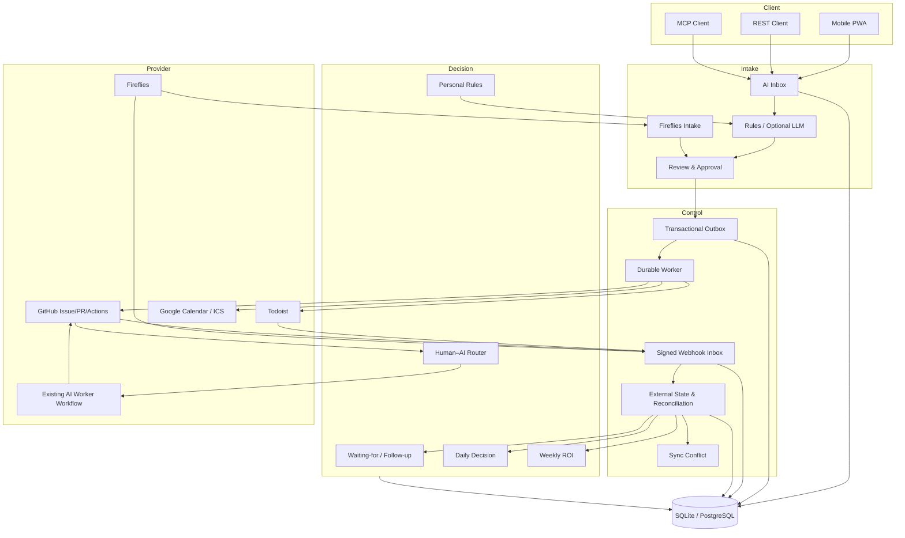

# 시스템 아키텍처 — JM-AI Action Hub v0.7.0

## 1. 논리 구조



## 2. 배포 구조

### 개인 로컬

```text
MacBook/HCI VM
├─ Action Hub API/PWA :8787
├─ Action Hub Worker
└─ SQLite WAL volume
```

개인 저부하 환경에서는 SQLite를 사용할 수 있다. API와 Worker를 여러 프로세스로 상시 운영하거나 Provider 이벤트가 많으면 PostgreSQL을 권장한다.

### 운영 권장

```text
Mobile/PC
   │
Tailscale/VPN or HTTPS Reverse Proxy
   │
Action Hub API container
   │
PostgreSQL
   │
Action Hub Worker container
   │
Provider APIs/Webhooks
```

API만 Migration을 실행하고 Worker는 준비 완료 후 시작한다.

## 3. 계층별 책임

### PWA/API/MCP

- 입력·검토·승인·Today Decision
- Action Hub API Key 전달
- Provider Token을 브라우저에 저장하지 않음
- 공유 원문을 POST로 전달

### Parser

- 원문을 Action 후보로 구조화
- 날짜·시간·프로젝트·저장소·실행자·예상시간 추출
- 모호성 표시
- 승인된 개인 규칙 적용
- 외부 쓰기 없음

### Approval

- 항목 수정과 선택 승인
- 구조적 재검증
- 검토 우회 차단
- 외부 쓰기와 AI 위임의 사람 결정 기록

### Outbox/Worker

- 등록 요청의 내구성 보장
- 중복 키, 선점, 재시도, stale-lock 복구
- Connector 실패 격리
- 응답 유실 복구

### Webhook/State Sync

- Provider 서명과 Delivery 중복 검증
- 외부 상태를 Action에 반영
- 순서 역전 이벤트 방어
- 누락 상태를 Reconciliation으로 대조
- 불확실한 404를 Conflict로 격리

### Human–AI Router

- AI/Hybrid Action만 기존 Worker Workflow로 위임
- Workflow, Check, PR Artifact를 Action과 연결
- Human Review Gate 유지
- PR Merge를 완료 증거로 처리

### Decision Services

- Follow-up due 처리
- 일일 가용량·과부하·Top/Deferred 계산
- 개인 규칙 제안
- Weekly ROI 집계

## 4. 데이터 경계

Action Hub가 저장한다.

- 원문과 Action 후보
- 수정·승인·거부 이력
- Outbox와 Webhook Delivery
- 외부 ID·URL·상태의 최소 Mirror
- Worker 실행·PR/Check/완료 증거
- Follow-up·Meeting Intake·Personal Rule·Metric
- 오류·충돌·감사 이벤트

저장하지 않는다.

- Todoist/GitHub/Google/Fireflies Token과 Webhook Secret
- 외부 시스템 전체 객체 복제본
- 회의 원본 오디오
- AI 모델 내부 상태
- 브라우저의 Provider Token

## 5. 일관성 모델

- 외부 등록: at-least-once + idempotency
- Provider 상태: Webhook 우선 + 주기적 Reconciliation
- 최종 원장: 해당 Provider
- Action Hub 상태: 외부 원장의 최소 투영과 실행 맥락
- 충돌: 자동 삭제보다 명시적 Conflict
- 완료 상태: 단조 증가가 기본이며 강한 외부 재오픈 이벤트만 되돌릴 수 있음

## 6. 장애 모델

| 장애 | 처리 |
|---|---|
| Parser 실패 | hybrid는 rules fallback, llm-only는 503 |
| API 종료 직전 | 트랜잭션 Outbox가 요청 보존 |
| Worker 중단 | stale processing lock 회수 후 재처리 |
| Provider timeout | Retry, Action ID로 기존 객체 검색 |
| Webhook 중복 | Delivery unique로 한 번만 적용 |
| Webhook 누락 | Reconciliation으로 복구 |
| 이벤트 순서 역전 | 외부 updated_at과 단조 상태 규칙 적용 |
| 외부 404 | Sync Conflict 생성, 즉시 삭제 확정 금지 |
| AI 실행 상관키 불명확 | 임의 연결하지 않고 unmatched |
| Google 401 | Refresh Token Broker로 한 번 갱신 후 재시도 |
| Connector 하나 장애 | 해당 이벤트만 실패, 다른 작업 계속 |

## 7. 성능·한계

- 입력 기본 최대 30,000자
- 요청 본문 기본 최대 1 MiB
- 한 입력 최대 100개 fragment
- 규칙 Parser는 동기 실행
- 외부 호출은 Worker에서 수행 가능
- SQLite는 개인·저부하, PostgreSQL은 다중 프로세스 운영
- Provider rate limit은 Retry 대상이나 무제한 자동 반복하지 않음

## 8. 보안 구조

- API Key Guard와 Production readiness
- Provider HMAC constant-time 비교
- Secret 환경변수 관리
- CSP `script-src 'self'`, frame 차단, no-store
- Production HSTS
- 제한된 CORS
- Docker non-root, capability drop
- Reverse Proxy 요청 크기 제한
- 승인 없는 자동 Merge·배포·외부 발송 금지

## 9. 확장 지점

- `ActionParser`: 로컬 모델·다른 JSON LLM
- `Connector`: Outlook, Plane, OpenProject
- `WorkerAdapter`: 추가 Agent Runtime
- `Reconciler`: Calendar push·다른 Provider
- `MeetingAdapter`: 다른 회의 서비스
- `RuleEngine`: 사용자별 규칙
- 인증: OIDC/RBAC/tenant isolation

확장 기능은 실사용 병목이 확인된 경우에만 추가한다.
