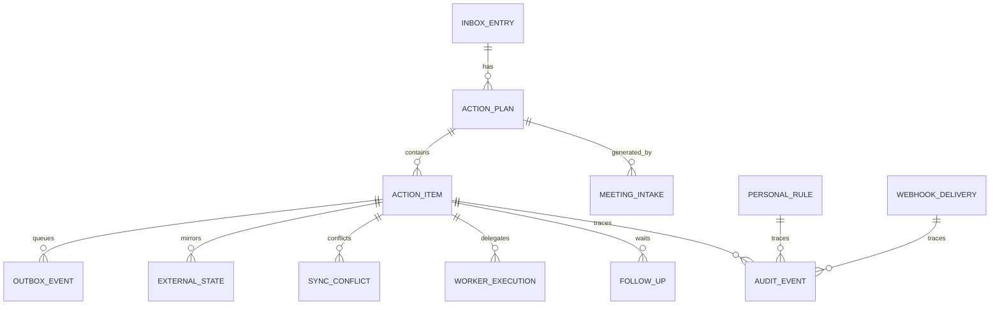

# 데이터 모델 및 API 명세 — JM-AI Action Hub v0.7.0

## 1. 핵심 ERD



## 2. 주요 엔터티

### InboxEntry

```text
id, raw_text, source, timezone, fingerprint,
metadata_json, created_at
```

### ActionPlan

```text
id, inbox_id, status, parser_name, summary,
reference_time, created_at, updated_at
```

### ActionItem

```text
id, plan_id, item_type, destination, title, description
source_fragment, start_at, end_at, due_at, deadline_at
earliest_start_at, latest_finish_at
estimated_minutes, actual_minutes
project, repository, assignee, labels, priority
work_mode, energy_level, executor, preferred_worker
waiting_for, follow_up_at, depends_on
needs_review, review_reason, confidence
state, fingerprint, external_id, external_url
execution_payload, execution_error
registered_at, completed_at, completion_evidence
reschedule_count, created_at, updated_at
```

### OutboxEvent

```text
id, action_item_id, operation, destination, payload
idempotency_key, state, attempts, next_retry_at
locked_at, locked_by, last_error, completed_at
```

### WebhookDelivery

```text
id, provider, delivery_id, event_type
signature_valid, payload_hash, payload
status, attempts, locked_at, processed_at, error
```

### ExternalState

```text
action_item_id, provider, external_id, external_state
external_updated_at, last_synced_at, source_version
metadata_json, sync_error
```

### SyncConflict

```text
action_item_id, provider, conflict_type
local_value, external_value, resolution
created_at, resolved_at
```

### WorkerExecution

```text
action_item_id, worker, state, execution_id
repository, workflow, workflow_run_id
pull_request_number, pull_request_url
check_url, result, error, started_at, completed_at
```

### FollowUp

```text
action_item_id, state, waiting_for, channel
waiting_since, expected_by, follow_up_at
template, reminder_count, response_received_at
resolved_at, note
```

### MeetingIntake / PersonalRule / MetricEvent

회의 Delivery와 Plan 연결, 승인형 규칙, 주간 ROI 원천 이벤트를 저장한다.

## 3. 시간 저장 정책

모든 aware datetime은 UTC로 정규화해 저장하고 API 응답 시 timezone-aware 값으로 복원한다. SQLite와 PostgreSQL에서 같은 의미를 유지한다.

## 4. 인증 경계

보호 API:

```http
X-Action-Hub-Key: <configured key>
```

- development/test에서 Key 미설정 시 로컬 사용 허용
- production에서 안전한 Key 미설정 시 503
- 틀린 Key는 401
- `/health`, `/readiness`, PWA 정적 파일은 공개 가능하나 네트워크 레벨 보호 권장
- Webhook은 Action Hub API Key가 아니라 Provider 서명으로 인증

## 5. 입력·계획 API

### `POST /api/v1/inbox/parse`

```json
{
  "text": "내일 오전 10시 고객 미팅, 금요일까지 제안서 2시간",
  "source": "paste",
  "timezone": "Asia/Seoul",
  "reference_time": "2026-07-29T09:00:00+09:00",
  "force_new": false
}
```

새 Plan은 201, 동일 입력 재사용은 200과 `X-Action-Hub-Deduplicated: true`.

### `GET /api/v1/plans`

Query:

```text
limit / status
```

ExternalState, WorkerExecution, FollowUp을 포함한다.

### `PATCH /api/v1/plans/{plan_id}/items/{item_id}`

Action enrichment와 실행자 필드를 수정한다. 완료·거부·중복 종료 상태의 잘못된 수정은 409.

### `POST /api/v1/plans/{plan_id}/approve`

```json
{
  "item_ids": ["uuid"],
  "actor": "jmpark",
  "force_review_items": false
}
```

### `POST /api/v1/plans/{plan_id}/execute`

```json
{
  "item_ids": null,
  "actor": "jmpark",
  "retry_failed": true,
  "drain_inline": false
}
```

응답의 `completed`는 v0.1 호환용 등록+완료 수이며, 실제 업무 완료는 `action_completed`, 등록은 `registered`, 대기는 `queued`로 구분한다.

## 6. Webhook·상태 API

### `POST /api/v1/webhooks/{provider}`

Provider:

```text
todoist / github / fireflies
```

응답 202:

```json
{
  "accepted": true,
  "duplicate": false,
  "delivery_id": "provider-delivery-id",
  "provider": "github",
  "event_type": "pull_request"
}
```

### `POST /api/v1/control/reconcile`

```json
{
  "providers": ["todoist", "github", "google_calendar"],
  "limit": 100
}
```

### 운영 제어

```text
POST /api/v1/control/run-once
POST /api/v1/control/outbox/drain
POST /api/v1/control/webhooks/drain
GET  /api/v1/control/webhooks
```

## 7. Worker·Follow-up·Planning API

```text
GET  /api/v1/workers/status
POST /api/v1/items/{item_id}/dispatch
POST /api/v1/items/{item_id}/followups
GET  /api/v1/followups/due
POST /api/v1/followups/process-due
POST /api/v1/followups/{id}/resolve
POST /api/v1/planning/decision
GET  /api/v1/brief/today
```

Worker dispatch는 승인 상태·실행자·중복 활성 실행을 검증한다.

## 8. Meeting·Rule·Report API

```text
GET   /api/v1/meetings
POST  /api/v1/meetings/{id}/reprocess
GET   /api/v1/rules
POST  /api/v1/rules
PATCH /api/v1/rules/{id}
POST  /api/v1/rules/suggest
GET   /api/v1/reports/weekly
```

Personal Rule은 안전 allowlist 밖의 action 필드를 422로 거부한다.

## 9. Connector·감사·파일 API

```text
GET /api/v1/connectors/status?probe=true
GET /api/v1/audit?limit=100&entity_id=...
GET /api/v1/exports/{filename}
```

ICS 응답은 API Key로 보호되고 `Cache-Control: private, no-store`를 사용한다.

## 10. Health

```text
GET /health
GET /readiness
```

Readiness는 DB 연결, Production API Key, 실행 모드, Parser 모드, Worker inline 여부를 반환한다.

## 11. 오류 코드

| 코드 | 의미 |
|---:|---|
| 200 | 조회·수정·중복 입력 반환 성공 |
| 201 | 새 Plan 생성 |
| 202 | Webhook 수신·큐잉 |
| 400 | 잘못된 Content-Length 등 요청 오류 |
| 401 | API Key 또는 Webhook 서명 오류 |
| 404 | Plan·Item·Follow-up·Meeting 없음 |
| 409 | 상태 충돌·중복 활성 Worker·승인 조건 불충족 |
| 413 | 요청 본문 크기 초과 |
| 422 | Schema·시간대·Provider·안전 규칙 오류 |
| 500 | 내부 오류, stack trace 비노출 |
| 503 | Production 필수 설정·LLM·Webhook Secret 부족 |

## 12. 마이그레이션

Alembic revisions:

```text
0001_initial_v010
0002_action_control_loop
0003_operational_hardening
```

v0.1 직접 생성 DB는 baseline 테이블을 확인한 뒤 0001로 stamp하고 추가 migration만 적용한다.
